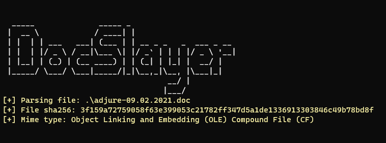
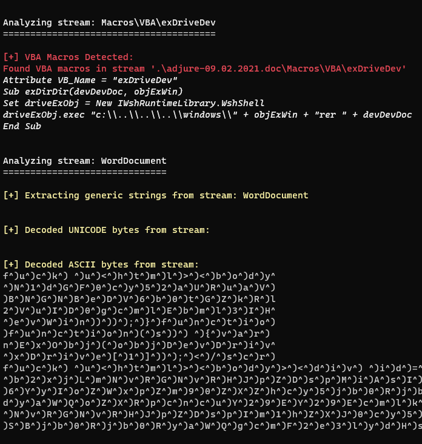

<h1>DocSlayer</h1>
DocSlayer is a static analysis tool for common Office formats and PDF files.
The main goal of the tool is to automate static analysis as much as possible.
It currently supports OLE, OOXML, RTF and PDF files.

DocSlayer source code is directly based on the tool Maldoc-Parser: 
https://github.com/DanielBres/MalDocs-Parser/tree/main/Linux 

🌎 https://www.precysec.com


[](https://twitter.com/precysec)

[](https://www.linkedin.com/company/precysec)


### Usage: (windows/Linux)

Compiled release:
```bash
docslayer <MALDOC_FILEPATH>
```

Python:
```bash
python docslayer,py <MALDOC_FILEPATH>
```





