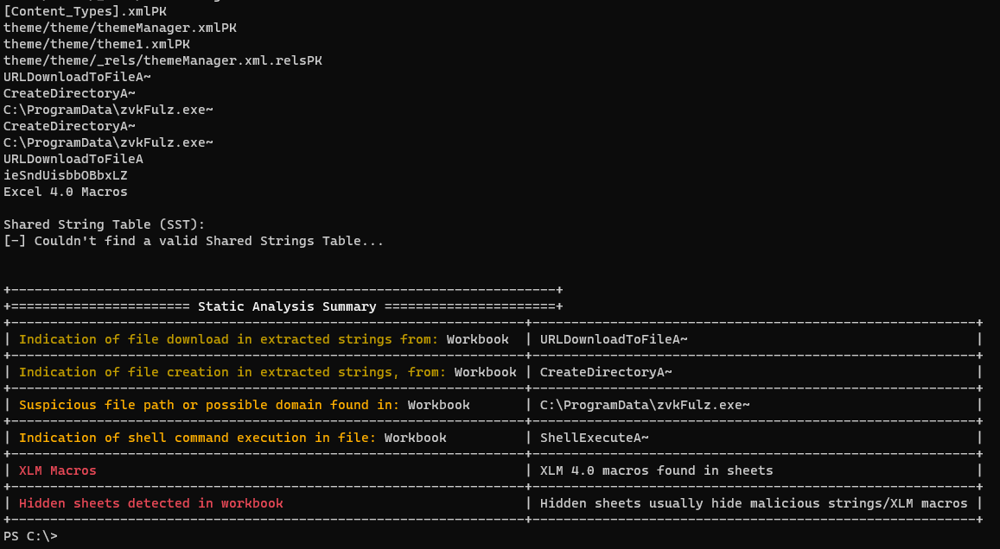

# DocSlayer
DocSlayer is a static analysis tool for common Office formats and PDF files.
The main goal of the tool is to automate static analysis as much as possible.
It currently supports OLE, OOXML, RTF and PDF files.


### Usage: (windows/Linux)

Compiled release:
```bash
docslayer <MALDOC_FILEPATH>
```

Python:
```bash
python docslayer,py <MALDOC_FILEPATH>
```





